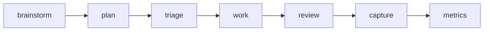

# Compound Workflow

Compound Workflow is a portable, command-first system for shipping software with less ambiguity and stronger verification.
It follows a simple cycle: **clarify -> plan -> execute -> verify -> capture**.
Use it when you want repeatable delivery without ad-hoc process drift.

Inspired by [Compound Engineering](https://every.to/guides/compound-engineering) (Every).

Best fit when you need:

- Clear intent and acceptance criteria before coding
- Structured execution with explicit review gates
- A repeatable process that captures reusable learnings

## Workflow

The workflow turns a request into validated output and reusable team knowledge.



## Get Started

```bash
npm install compound-workflow
```

`npm install` adds the package and automatically configures your repo (`AGENTS.md`, required directories, and runtime wiring).
If your package manager skips lifecycle scripts, run `npx compound-workflow install` manually.

Install configures:

- Workflow template content in `AGENTS.md`
- Standard workspace directories for plans/todos/docs
- Runtime configuration used by supported tools

After install, start with:

1. `/workflow:brainstorm` for requirements clarity
2. `/workflow:plan` for implementation design
3. `/workflow:work` to execute against the approved plan

## Commands (Quick Map)

Core flow: `/workflow:brainstorm` -> `/workflow:plan` -> `/workflow:triage` -> `/workflow:work` -> `/workflow:review` -> `/workflow:compound` -> `/metrics` (optional `/assess` for rollups).

Canonical command docs: [src/.agents/commands/](src/.agents/commands/)

## Learn More

- Workflow principles: [docs/principles/workflow-baseline-principles.md](docs/principles/workflow-baseline-principles.md)
- Project command and policy index: [src/AGENTS.md](src/AGENTS.md)
- Command definitions: [src/.agents/commands/](src/.agents/commands/)

If there is any conflict across docs, treat principles as the tiebreaker, then `src/AGENTS.md`, then command docs.
