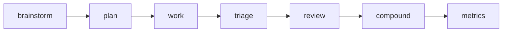

# Compound Workflow (.agents)

A portable, command-first workflow: **clarify → plan → execute → verify → capture**. Commands are the public API; skills and agents are composable internals.

It reduces delivery failures from **unclear intent**, **weak verification**, and **lost context**. Use it when you want structured cycles without ad-hoc tooling.

*This template and README are continually refined during development.*

Inspired by [Compound Engineering](https://every.to/guides/compound-engineering) (Every) — the AI-native philosophy that each unit of work should compound into the next.

Runtime assets live in `src/.agents/` and `src/AGENTS.md`. **Cursor/Claude:** load via plugin. **OpenCode:** install the npm package and run Install once.

---

## Get started

**One action:** In your project (with compound-workflow as a dependency), run **Install**—either the `/install` command in Cursor/Claude or:

```bash
npm install compound-workflow
npx compound-workflow install
```

Optional: `--dry-run` (preview), `--root /path/to/project`, `--no-config` (skip Repo Config Block reminder).

Install writes `opencode.json` (OpenCode loads from the package), merges `AGENTS.md` (preserves your Repo Config Block), creates standard dirs, and reminds you to set the Repo Config Block in `AGENTS.md` if needed. No copy; Cursor/Claude use the plugin; OpenCode reads from `node_modules/compound-workflow`.

**Cursor / Claude:** Add the compound-workflow plugin (from this repo or marketplace). Then in any repo you can run `/install` or use the CLI above.

**Legacy (clone inside repo):** If you cloned this repo inside a host repo and need to copy files without npm, use `./scripts/sync-into-repo.sh` (copy only; does not update opencode.json). Prefer the npm + Install flow above.


---

## Workflow at a glance

Clarify what to build → plan how (fidelity + confidence) → execute via todos → triage and review → capture learnings → log and assess.



---

## Step-by-step: intent and commands

| Step | Intent | Command | Output / note |
|------|--------|---------|---------------|
| Clarify what to build | Dialogue only; no code | `/workflow:brainstorm [topic]` | `docs/brainstorms/` |
| Define how (fidelity + confidence) | Plan only; no code | `/workflow:plan [description or brainstorm path]` | `docs/plans/` |
| Execute | File-based todos; risk-tier testing; no auto-ship | `/workflow:work <plan-path>` | `todos/` |
| Ready the queue | Priority and dependencies for pending todos | `/workflow:triage` | — |
| Validate quality | Evidence-based review; no fixes by default | `/workflow:review [PR, branch, or current]` | pass / pass-with-notes / fail |
| Capture learnings | One solution doc for future use | `/workflow:compound [context]` | `docs/solutions/` |
| Log and improve | Session log + optional aggregate review | `/metrics` + `/assess weekly 7` (or monthly) | `docs/metrics/daily/`, weekly/monthly |

#### 1. Clarify (brainstorm)

**Intent:** Dialogue only; no code. **Command:** `/workflow:brainstorm [topic]`. **Output:** `docs/brainstorms/`.

#### 2. Define how (plan)

**Intent:** Plan only; no code; fidelity + confidence. **Command:** `/workflow:plan [description or brainstorm path]`. **Output:** `docs/plans/`.

#### 3. Execute (work)

**Intent:** File-based todos; risk-tier testing; no auto-ship. **Command:** `/workflow:work <plan-path>`. **Output:** `todos/`.

#### 4. Ready the queue (triage)

**Intent:** Priority and dependencies for pending todos. **Command:** `/workflow:triage`. **Output:** —.

#### 5. Validate quality (review)

**Intent:** Evidence-based review; no fixes by default. **Command:** `/workflow:review [PR|branch|current]`. **Output:** pass / pass-with-notes / fail.

#### 6. Capture learnings (compound)

**Intent:** One solution doc for future use. **Command:** `/workflow:compound [context]`. **Output:** `docs/solutions/`.

#### 7. Log and improve

**Intent:** Session log + optional aggregate review. **Command:** `/metrics` + `/assess weekly 7` (or monthly). **Output:** `docs/metrics/daily/`, weekly/monthly.

**Optional QA:** **`/test-browser [PR|branch|current]`** — Browser validation on affected pages via **agent-browser CLI only** (not MCP). Install: `npm install -g agent-browser` then `agent-browser install`. See [src/.agents/commands/test-browser.md](src/.agents/commands/test-browser.md).

---

## Command reference

**Onboarding:** `/install` — one action: writes opencode.json, merges AGENTS.md, creates dirs, preserves Repo Config Block. Run `npx compound-workflow install` in the project (requires `npm install compound-workflow`).

**Core workflow:** See [Step-by-step](#step-by-step-intent-and-commands) above.

**QA:** `/test-browser [PR|branch|current]` — browser checks on affected routes (agent-browser CLI only).

**Improvement:** `/metrics [plan|todo|pr|solution|label]` — log session to `docs/metrics/daily/` and assess. `/assess [daily|weekly|monthly] [count]` — aggregate metrics and optional summary files.

**Experimental:** `/workflow:review-v2 [PR|branch|current]` — interactive snippet review; output-only (no GitHub publish).

Full detail: [src/AGENTS.md](src/AGENTS.md), [src/.agents/commands/](src/.agents/commands/).

---

## Artifacts

- **Brainstorms:** `docs/brainstorms/YYYY-MM-DD-<topic>-brainstorm.md`
- **Plans:** `docs/plans/YYYY-MM-DD-<type>-<slug>-plan.md`
- **Todos:** `todos/{id}-{status}-{priority}-{slug}.md`
- **Solutions:** `docs/solutions/<category>/YYYY-MM-DD-<module-slug>-<symptom-slug>.md`
- **Metrics:** `docs/metrics/daily/YYYY-MM-DD.md`, `docs/metrics/weekly/YYYY-WW.md`, `docs/metrics/monthly/YYYY-MM.md`

---

## How it works (internals)

Commands are the public API. Skills and agents are invoked by commands; you don’t call them directly.

- **Workflow skills:** `brainstorming`, `file-todos`, `compound-docs`, `document-review`, `technical-review`, `git-worktree`, `agent-browser`, `process-metrics`.
- **Guardrail standards:** `data-foundations`, `pii-protection-prisma`, `financial-workflow-integrity`, `audit-traceability` — applied when work touches multi-tenant data, PII, money, or audit.
- **Agents:** Used by plan, review, and work for research, lint, and validation (e.g. `repo-research-analyst`, `learnings-researcher`, `git-history-analyzer`, `agent-native-reviewer`).

Full “when to use what” and reference standards: [src/AGENTS.md](src/AGENTS.md).

---

## Guardrails

- **No auto-ship:** `/workflow:work` and `/workflow:review` do not commit, push, or create PRs by default.

- **Brainstorm and plan do not write code.** Output is documents only.

- Add a separate shipping command if you want automated commit/PR and quality gates.

---

## Configuration and optional bits

**Repo configuration:** Commands read a **Repo Config Block** (YAML) in `AGENTS.md` for `default_branch`, `dev_server_url`, `test_command`, etc. Run **`/install`** once; then edit `AGENTS.md` to set the Repo Config Block.

**agent-browser:** `/test-browser` uses the agent-browser CLI only. Install: `npm install -g agent-browser` then `agent-browser install`. See [src/.agents/commands/test-browser.md](src/.agents/commands/test-browser.md).

**Source of truth**

- Workflows and commands: [src/.agents/](src/.agents/)
- Principles and skill index: [src/AGENTS.md](src/AGENTS.md)
