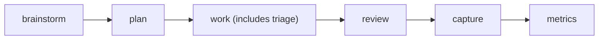

# Compound Workflow

Compound Workflow is a portable, command-first system for shipping software with less ambiguity and stronger verification.
It follows a simple cycle: **clarify -> plan -> execute -> verify -> capture**.
Use it when you want repeatable delivery without ad-hoc process drift.

Inspired by [Compound Engineering](https://every.to/guides/compound-engineering) (Every).

Best fit when you need:

- Clear intent and acceptance criteria before coding
- Structured execution with explicit review gates
- A repeatable process that captures reusable learnings

## Workflow

The workflow turns a request into validated output and reusable team knowledge.



## Get Started

```bash
npm install compound-workflow
```

`npm install` adds the package and automatically configures your repo (`AGENTS.md`, required directories, and runtime wiring).
If your package manager skips lifecycle scripts, run `npx compound-workflow install` manually.

Install configures:

- Workflow template content in `AGENTS.md`
- Standard workspace directories for plans/todos/docs
- Runtime configuration used by supported tools

After install, start with:

1. `/workflow:brainstorm` for requirements clarity
2. `/workflow:plan` for implementation design
3. `/workflow:work` to execute against the approved plan (includes automatic triage)
4. `/workflow:review` to validate quality before completion
5. `/workflow:compound` to capture reusable learnings

## Commands (Quick Map)

Core flow: `/workflow:brainstorm` -> `/workflow:plan` -> `/workflow:work` -> `/workflow:review` -> `/workflow:compound` -> `/metrics` (optional `/assess` for rollups).

| Command | Purpose | Related skills | Related agents |
|---|---|---|---|
| `/install` | Configure workflow files and runtime wiring in the repo | install CLI (no workflow skill routing) | none |
| `/workflow:brainstorm` | Clarify what to build through structured discussion | `brainstorming` (primary), `document-review` (optional refinement) | `repo-research-analyst` |
| `/workflow:plan` | Convert intent into an executable plan with fidelity/confidence | state-orchestration skill when needed (for example `xstate-actor-orchestration`) | `repo-research-analyst`, `learnings-researcher`, `best-practices-researcher`, `framework-docs-researcher`, `git-history-analyzer`, `spec-flow-analyzer`, `planning-technical-reviewer` |
| `/workflow:triage` | Manual queue curation for complex/multi-item backlogs (optional; `/workflow:work` runs triage automatically) | `file-todos` | none |
| `/workflow:work` | Execute plan/todos with quality gates and validation evidence | `git-worktree`, `file-todos`, `standards`, state-orchestration skill when needed | `repo-research-analyst`, `learnings-researcher`, `best-practices-researcher`, `framework-docs-researcher`, `git-history-analyzer` |
| `/workflow:review` | Perform independent quality review before completion | `git-worktree` (for non-current targets), `standards` | `learnings-researcher`, `lint`, `bug-reproduction-validator`, `git-history-analyzer`, `framework-docs-researcher`, `agent-native-reviewer` |
| `/workflow:compound` | Capture reusable implementation learnings in `docs/solutions/` | `compound-docs` (primary), `document-review` (optional) | `learnings-researcher`, `best-practices-researcher`, `framework-docs-researcher` |
| `/metrics` | Log session outcomes and improvement actions | `process-metrics`, `file-todos` (optional for follow-ups) | none |
| `/assess` | Aggregate metrics trends and propose process improvements | `file-todos` (for approved follow-up actions) | none |
| `/test-browser` | Validate affected routes with browser-level checks | `agent-browser`, `git-worktree` (optional branch isolation) | none |

Canonical command docs: [src/.agents/commands/](src/.agents/commands/)

## Learn More

- Workflow principles: [docs/principles/workflow-baseline-principles.md](docs/principles/workflow-baseline-principles.md)
- Project command and policy index: [src/AGENTS.md](src/AGENTS.md)
- Command definitions: [src/.agents/commands/](src/.agents/commands/)

If there is any conflict across docs, treat principles as the tiebreaker, then `src/AGENTS.md`, then command docs.
